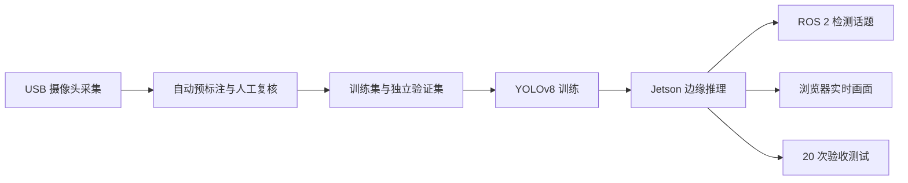

# 基于 Jetson 与 ROS 2 的实时目标检测系统

这是一个完整的机器人视觉课程项目：使用 USB 摄像头采集桌面物体，通过 YOLOv8 完成
`cup`、`mouse`、`keyboard`、`bottle` 四类目标训练，并在 Jetson Orin NX 上实时推理，
同时向 ROS 2 发布检测结果并提供浏览器画面。

[查看完整运行步骤](实验01_目标检测与识别/README.md) ·
[下载展示模型与 20 秒视频](https://github.com/dc4008-rgb/robot-integration-project/releases/tag/experiment1-demo-20260831)

## 系统流程



## 核心结果

| 项目 | 结果 |
|---|---|
| 检测类别 | cup、mouse、keyboard、bottle |
| 最新训练数据 | 709 张图、1155 个目标框、44 张纯负样本 |
| 独立验证集 | 24 张图、73 个目标框 |
| 展示模型 | YOLOv8n，mAP50 0.5236，mAP50-95 0.3797 |
| Jetson 实时速度 | 约 15 FPS，课程要求为 ≥5 FPS |
| ROS 2 输出 | `/detections` 与 `/detection_image`，约 15 Hz |
| 网页展示 | MJPEG 实时画面、类别、置信度和检测框 |
| 展示视频 | H.264，1280×720，15 FPS，20 秒 |

离线指标来自冻结独立验证集，实时速度来自 Jetson Orin NX 实测。展示模型已跑通四类实时
演示，但仍需完成最终 20 次正式复测；仓库没有把展示视频当作正确率验收结果。

## 仓库结构

```text
实验01_目标检测与识别/
├── 01_数据采集/       摄像头检查与训练图片采集
├── 02_数据集/         自动标注、数据下载与训练/验证划分
├── 03_训练/           YOLOv8 训练与远程同步
├── 04_Jetson部署/     TensorRT 导出、ROS 2 节点与网页服务
├── 05_验收测试/       FPS 和 20 次正确率验收
└── README.md          从采集到验收的完整命令
```

仓库只保留能够复现主流程的代码。原始图片、训练权重、逐轮实验报告和视频分别放在本地归档
或 GitHub Release 中，不让研发过程文件干扰项目展示。

## 讲解顺序

1. **采集**：先比较 MJPG 与 YUYV 的真实帧率，再按类别和场景采图。
2. **标注**：用 COCO 权重预标注四类目标，人工补漏框、删误框。
3. **训练**：训练数据与独立验证数据分离，在 GPU 服务器上训练 YOLOv8n。
4. **部署**：模型放到 Jetson，摄像头只推理一次，同时服务 ROS 2 和网页端。
5. **验收**：统一阈值测试 20 个物体，自动保存正确率、FPS 和错误案例。

这个顺序对应代码目录，可以从问题、方法、部署一直讲到评价标准，不需要展开中间每轮调参
和候选模型筛选过程。

## 设计要点

- UVC 摄像头固定使用 MJPG，避免 720p YUYV 带宽限制拖慢采集。
- 公开数据只进入训练集，验证集来自独立实拍，减少数据泄漏。
- 纯负样本用于抑制耳机盒、手机等相似物误报。
- 网页与 ROS 2 复用同一次推理结果，不重复占用 GPU。
- 数据集、模型和测试结果分开管理，源码仓库保持轻量清晰。