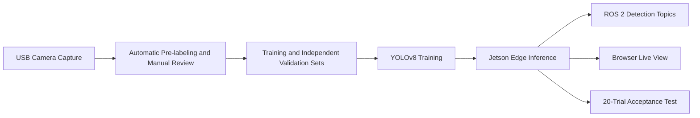

# Real-Time Object Detection with Jetson and ROS 2

This course project implements a complete robot-vision workflow. A USB camera captures desktop objects,
YOLOv8 detects `cup`, `mouse`, `keyboard`, and `bottle`, and a Jetson Orin NX performs real-time
inference while publishing ROS 2 messages and serving a browser-based live view.

[View the complete workflow](experiment01_object_detection/README.md) | [Download the demo model and 20-second video](https://github.com/dc4008-rgb/robot-integration-project/releases/tag/experiment1-demo-20260831)

## System Workflow



## Key Results

| Item | Result |
|---|---|
| Detection classes | cup, mouse, keyboard, bottle |
| Latest training data | 709 images, 1,155 bounding boxes, 44 pure-negative images |
| Independent validation set | 24 images, 73 bounding boxes |
| Demonstration model | YOLOv8n, mAP50 0.5236, mAP50-95 0.3797 |
| Jetson throughput | Approximately 15 FPS; course requirement: at least 5 FPS |
| ROS 2 output | `/detections` and `/detection_image` at approximately 15 Hz |
| Browser view | Live MJPEG video with classes, confidence scores, and bounding boxes |
| Demonstration video | H.264, 1280 x 720, 15 FPS, 20 seconds |

The offline metrics come from a frozen independent validation set, while the runtime measurements come
from the Jetson Orin NX. The demonstration model completes the four-class live workflow, but the final
20-trial acceptance retest is still pending. The demonstration video is not presented as an accuracy result.

## Repository Structure

```text
experiment01_object_detection/
|-- 01_data_collection/       Camera checks and training-image capture
|-- 02_dataset/               Pre-labeling, data download, and train/validation preparation
|-- 03_training/              YOLOv8 training and remote synchronization
|-- 04_jetson_deployment/     TensorRT export, ROS 2 node, and web service
|-- 05_acceptance_testing/    FPS benchmark and 20-trial accuracy test
`-- README.md                 Complete commands from capture to acceptance testing
```

Only the code required to reproduce the main workflow is kept in the repository. Raw images, model
weights, per-run research reports, and videos are stored locally or in GitHub Releases so that the public
project structure remains concise.

## Recommended Presentation Order

1. **Capture:** compare real MJPG and YUYV throughput, then collect images across classes and scenes.
2. **Label:** use COCO weights to pre-label the four classes, then manually correct missing or incorrect boxes.
3. **Train:** separate training data from independent validation data and train YOLOv8n on a GPU server.
4. **Deploy:** run the model on the Jetson and reuse one inference result for both ROS 2 and the web view.
5. **Evaluate:** test 20 physical objects with fixed thresholds and save accuracy, FPS, and error cases.

This sequence follows the source tree and supports a clear explanation from problem definition and method
through deployment and evaluation, without exposing every intermediate tuning run.

## Engineering Decisions

- Force MJPG for the UVC camera to avoid the 720p YUYV USB bandwidth bottleneck.
- Keep public training data out of the independent camera-domain validation set.
- Use pure-negative images to reduce false positives from similar objects such as headphone cases and phones.
- Reuse each inference result for the browser and ROS 2 instead of running the model twice.
- Keep datasets, models, and test artifacts separate from the lightweight source repository.