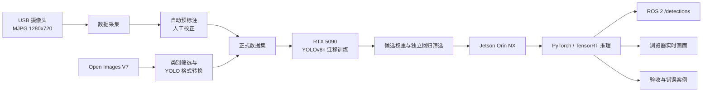

# 基于 Jetson 与 ROS 2 的实时目标检测系统

## 项目概述

本项目面向机器人视觉感知场景，完成了一个从数据采集、目标标注、云端训练到
Jetson 边缘部署和 ROS 2 消息发布的端到端目标检测系统。系统使用 YOLOv8n 识别
`cup`、`mouse`、`keyboard` 和 `bottle` 四类桌面物体，并支持浏览器实时查看检测画面。

目前已经完成数据集构建、多轮模型训练、独立回归筛选、Jetson 实机诊断及展示视频录制。
最新训练集为 709 图、1155 框和 44 个空标签，冻结验证集为 24 图、73 框。Jetson 使用
自训练 `.pt` 模型时稳定约 **15.0 FPS**，高于课程要求的 5 FPS。初版模型在较小验证集上
曾取得 0.8692 mAP50，但后续实验采用更严格的独立验证与现场回归门，不再直接比较该数值。
2026-08-31 最新实验模型改善了灰瓶检测，但仍存在纯负误报和耳机盒误报，因此未替换此前
候选，也尚未宣告正式 20 次实物验收通过。

## 系统架构



## 核心成果

| 模块 | 已实现内容 |
|---|---|
| 数据采集 | USB 摄像头采图、设备扫描、MJPG/YUYV 实际帧率对比 |
| 数据处理 | COCO 模型自动预标注、人工修正、去重、固定类别映射 |
| 外部数据 | Open Images V7 按类下载、标签筛选、重映射及 YOLO 导出 |
| 数据划分 | 外部数据仅进入训练集，本地摄像头图片保留为验证集 |
| 模型训练 | RTX 5090 云端训练、早停、日志监控、权重与曲线自动拉回 |
| 模型选择 | 冻结验证集、纯负样本、耳机序列、混合键盘图和灰瓶场景联合筛选 |
| 边缘部署 | Jetson Orin NX 摄像头推理、TensorRT 导出脚本 |
| ROS 2 集成 | 发布检测数组与带框图像，包含类别、置信度和边界框 |
| 可视化 | 无显示器时通过浏览器查看 MJPEG 实时画面、FPS 和目标数 |
| 验收工具 | 20 次逐物体测试、FPS 基准、错误图片和 CSV/JSON 结果保存 |

## 技术栈

| 类别 | 技术 |
|---|---|
| 训练与推理 | Python、Ultralytics YOLOv8、PyTorch、CUDA |
| 边缘计算 | Jetson Orin NX 16GB、JetPack 6.2、TensorRT 10.7 |
| 机器人中间件 | ROS 2 Humble、`vision_msgs`、`sensor_msgs`、`cv_bridge` |
| 视觉处理 | OpenCV、UVC USB 摄像头、MJPG |
| 数据来源 | 自采数据、COCO 预训练模型、Open Images V7 |
| 远程训练 | AutoDL、RTX 5090、SSH、rsync、nohup |

## 数据集

### 当前优化数据集

| 数据部分 | 图片数 | 目标框数 | 空标签数 | 用途 |
|---|---:|---:|---:|---|
| 最新训练集 | 709 | 1155 | 44 | 多轮复训 |
| 冻结独立验证集 | 24 | 73 | 0 | 模型指标比较 |
| 独立纯负回归集 | 17 | 0 | 17 | 相似物误报检查 |
| 耳机序列回归 | 20 帧 | 0 | - | `mouse` 误报检查 |

最新训练集包含四类各 100 张人工复核公开图、12 张补测灰色保温瓶正样本和 5 张耳机盒
空标签样本。训练、冻结验证与独立回归材料经过完全重复和感知近重复检查，避免把测试场景
泄漏进训练集。

### 初版数据构成（历史基线）

| 数据来源 | 图片数 | 目标框数 | 用途 |
|---|---:|---:|---|
| 本地摄像头采集 | 93 | 171 | 训练与验证 |
| Open Images V7 | 103 | 219 | 仅训练 |
| 正式训练集 | 178 | 353 | 模型训练 |
| 正式验证集 | 18 | 37 | 模型选择与阶段评估 |

训练集由 75 张本地图片和 103 张外部图片组成；验证集的 18 张图片全部来自本地摄像头，
避免外部数据同时进入训练集和验证集而造成指标虚高。

### 类别分布

| 类别 | 训练集框数 | 验证集框数 |
|---|---:|---:|
| cup | 62 | 9 |
| mouse | 64 | 8 |
| keyboard | 86 | 16 |
| bottle | 141 | 4 |
| **合计** | **353** | **37** |

所有图片与标签均完成一一配对检查，YOLO 类别编号、坐标范围和重复图片也经过自动审计。
Open Images 标签不保证覆盖画面中的全部物体，因此外部数据仍需人工关注漏框和误框。

## 模型训练与选择

| 项目 | 配置或结果 |
|---|---|
| 模型 | YOLOv8n，COCO 预训练权重迁移学习 |
| 输入尺寸 | 640 × 640 |
| Batch size | 16 |
| 计划轮数 | 150 epochs |
| 实际轮数 | 115 epochs，第 85 轮为最佳模型 |
| 早停策略 | 连续 30 轮无综合指标提升后停止 |
| 训练硬件 | NVIDIA GeForce RTX 5090 |
| 训练耗时 | 约 3.9 分钟 |

### 初版最佳模型指标

| 指标 | 结果 |
|---|---:|
| Precision | 0.922 |
| Recall | 0.698 |
| mAP50 | 0.8692 |
| mAP50-95 | 0.6919 |

| 类别 | AP50 |
|---|---:|
| cup | 0.8821 |
| mouse | 0.9950 |
| keyboard | 0.8546 |
| bottle | 0.7450 |

`mAP50-95` 会在 IoU 0.50 到 0.95 的十个阈值上取平均，比只要求 IoU 0.50 的
`mAP50` 更强调检测框定位精度，因此数值通常更低。训练过程中第 94 轮曾出现 0.9247
的单轮 mAP50，但模型选择依据综合指标，最终 `best.pt` 来自 mAP50-95 最佳的第 85 轮。

最佳权重已从服务器拉回，并通过远端与本地 SHA-256 一致性检查。训练曲线、混淆矩阵、
验证预测图和逐轮 CSV 均已归档。

### 独立回归筛选

| 实验模型 | mAP50 | mAP50-95 | 关键回归结果 | 决策 |
|---|---:|---:|---|---|
| 实拍困难样本 | 0.4401 | 0.2741 | 现场仍有耳机盒误报 | 保留作回退 |
| 双向增强增量模型 | 0.4374 | 0.3283 | 离线误报下降，现场灰瓶漏检 | 不替换 |
| 四类各增 100 张 | 0.5993 | 0.4430 | 纯负误报 11/17，耳机误报 10/20 | 淘汰 |
| 补测灰瓶与耳机盒 | 0.5236 | 0.3797 | 纯负误报 8/17，耳机误报 7/20 | 仅作实验 |

最新实验权重 SHA-256 为
`1e2e90c72c138aa2dc5ff7a6615bdbf5be5009fe86ae408c0c3ee43558cf1455`。对全部 57 个
训练轮次以及 baseline、best、last 共 60 个模型文件进行统一筛选后，没有模型或统一置信度
阈值能同时满足四项要求：纯负不误报、耳机不报 mouse、混合图检出真实键盘、灰瓶检出
bottle。因此模型选择以回归门为准，不能只按 mAP50 排序。

## Jetson 与 ROS 2 实测

测试平台为 Jetson Orin NX 16GB，系统环境为 JetPack 6.2、Ubuntu 22.04、
ROS 2 Humble。USB 摄像头使用 MJPG 1280×720 模式，避免 YUYV 未压缩视频占满 USB 带宽。

| 项目 | 基线实测结果 |
|---|---:|
| 摄像头取帧 | 33.8 ms/帧 |
| YOLOv8n `.pt` 推理 | 32.7 ms/帧 |
| 端到端速度 | 15.0 FPS |
| `/detections` 发布频率 | 14.95 Hz |
| 课程最低速度要求 | 5 FPS |

以上速度来自 COCO 预训练模型的全链路基线，用于证明摄像头、推理、ROS 2 和网页显示
链路可运行。自训练 `best.pt` 的 Jetson 实物正确率和 TensorRT 性能仍需完成最终验收，
不能用这组基线替代。

后续自训练 `.pt` 模型也在板端稳定达到约 15 FPS。2026-08-31 低照实验室展示使用曝光
320、亮度 12、增益 64、gamma 400，录制的用户版和同学版视频均为 H.264、1280×720、
15 FPS、20 秒、300 帧，并通过本地解码与抽帧检查。视频按仓库策略保存在本地结果目录，
不直接提交 Git；它们只证明展示链路正常，不代表模型通过全部独立回归门。

### ROS 2 接口

| 话题 | 消息类型 | 内容 |
|---|---|---|
| `/detections` | `vision_msgs/Detection2DArray` | 类别、置信度、边界框 |
| `/detection_image` | `sensor_msgs/Image` | 已绘制检测框的图像 |

网页端与 ROS 2 共用同一次模型推理结果，不会为了浏览器显示额外运行第二次推理。
系统还提供 `/status.json` 查询 FPS 和目标数，以及 `/snapshot.jpg` 保存单帧证据。

## 关键工程决策

1. **先定位摄像头瓶颈。** 实测并强制使用 MJPG，避免将 USB 带宽问题误判为模型性能问题。
2. **验证集保持本地域。** Open Images 只进入训练集，验证结果更接近 Jetson 实际画面。
3. **预标注不代替人工标注。** 自动框只用于提效，仍需补漏框、删误框和修正边界。
4. **使用轻量模型。** YOLOv8n 已满足当前正确率和实时性需求，便于后续边缘部署。
5. **训练结果可追溯。** 固定依赖版本，保存参数、CSV、曲线和权重，并校验传输哈希。
6. **敏感信息不入仓库。** 密码、私钥、数据集、模型权重和大体积训练输出均由忽略规则隔离。

## 项目目录

```text
实验01_目标检测与识别/
├── 01_数据采集/      # 摄像头检查与采图
├── 02_数据集/        # 预标注、外部数据转换、数据划分
├── 03_训练/          # 云端训练与同步脚本
├── 04_Jetson部署/    # TensorRT 导出与 ROS 2 检测节点
├── 05_验收测试/      # 正确率、FPS 和错误案例测试
├── README.md         # 完整运行指南
└── 实验一阶段记录.md  # 实测数据与阶段状态
```

## 当前边界与下一步

早期 20 次预验收在第 8 次暂停，结果为 7 次正确、1 次白色键盘漏检；这不是完整正式结果。
最新模型虽然改善新增灰瓶样本和现场展示效果，但仍未通过独立误报回归，不能用展示视频
替代正确率验收。

下一步工作：

1. 直接从 Jetson 实时流采集会触发起始模型 `mouse >= 0.25` 的耳机/耳机盒困难负样本。
2. 按采集序列隔离训练与回归数据，重训后再次执行四道独立门和全检查点筛选。
3. 仅在模型通过回归后，从零完成 20 次实物验收并归档正确率、FPS 和错误案例。
4. 将最终选定权重和视频放入 GitHub Release、Git LFS 或课程指定存储，不混入源码提交。

## 结论

本项目已经验证了从真实摄像头数据、公开数据筛选和云端训练，到 Jetson、ROS 2 与网页
实时展示的完整技术路径，板端速度稳定达到约 15 FPS。多轮实验同时表明，较高离线 mAP
并不保证现场相似物误报和灰瓶召回同时达标。当前成果包含可复现代码、数据配置、比较报告、
现场证据和展示视频；正式完成仍以新困难负样本训练、独立回归全过及从零 20 次验收为准。

详细运行步骤见 [实验01 README](实验01_目标检测与识别/README.md)，过程与实测记录见
[实验一阶段记录](实验01_目标检测与识别/实验一阶段记录.md)。